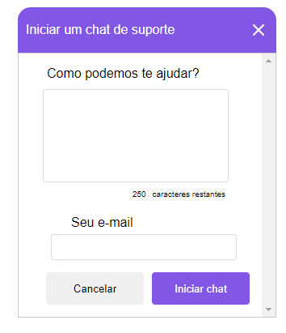

<h1 align="center">Chatty</h1>

<p align="center">This project was developed during the <strong><a href="https://nextlevelweek.com/">Next Level Week #5</a></strong> offered by <strong><a href="https://github.com/Rocketseat">@Rocketseat</a></strong></p>

<p align="center">During April 19-25, 2021</p> <br>

<p align="center">
  <a href="#-about">About</a>&nbsp;&nbsp;&nbsp;|&nbsp;&nbsp;&nbsp;
  <a href="#-technologies">Technologies</a>&nbsp;&nbsp;&nbsp;|&nbsp;&nbsp;&nbsp;
  <a href="#-getting-started">Getting Started</a>&nbsp;&nbsp;&nbsp;|&nbsp;&nbsp;&nbsp;
  <a href="#-license">License</a>
</p>

<p align="center">
  
  
  <a href="https://github.com/frankjrp/RocketSeat-NLW-4/commits/main">
    
  </a>
</p>

<p align="center">
  
</p>

## 🔖 About
The project **Chatty** is a real-time customer service chat.

## 🛠 Technologies
This project was developed using the following technologies:

- [Node.js](https://nodejs.org/en/)
- [TypeScript](https://www.typescriptlang.org/)
- [Express](https://expressjs.com/pt-br/)
- [Socket.io](https://socket.io/)

## 🚀 Getting Started
Clone the project and access the folder

```bash
$ git clone https://github.com/frankjrp/RocketSeat-NLW-5.git && cd Projeto
```
Follow the steps below

```bash
# Install the dependencies
$ yarn install

# Start the project
$ yarn dev

# The project will be available on port 3333 <http://localhost:3333>
```

## 📝 License
This project is licensed under the MIT License. See the [LICENSE](LICENSE) file for details.
